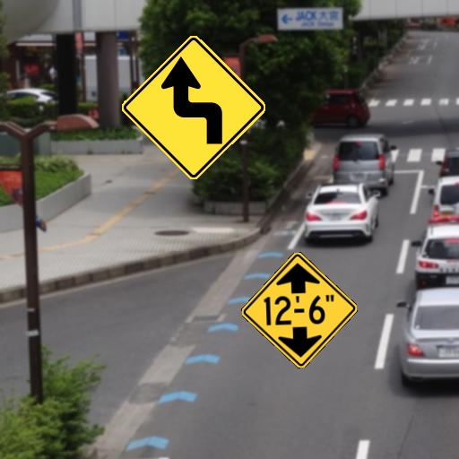
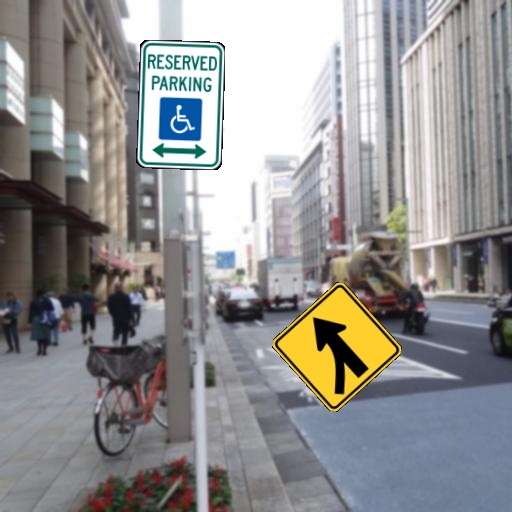
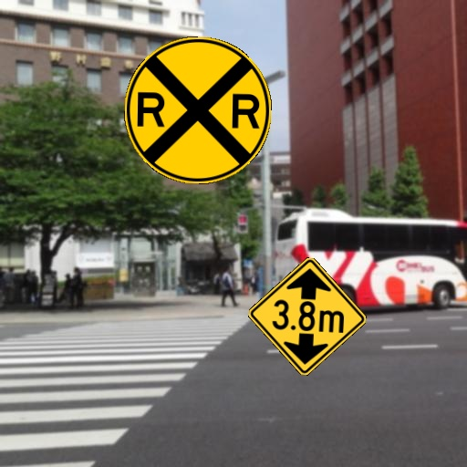
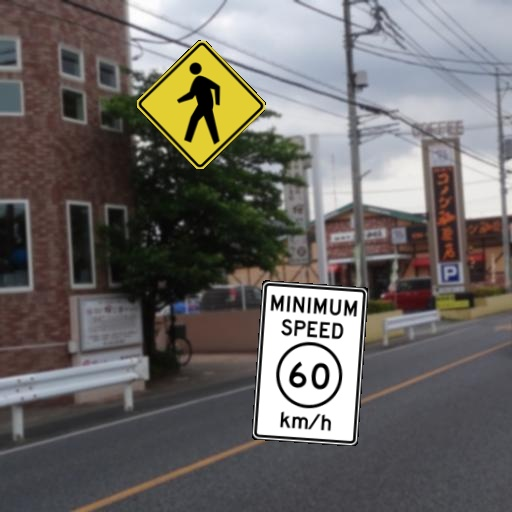
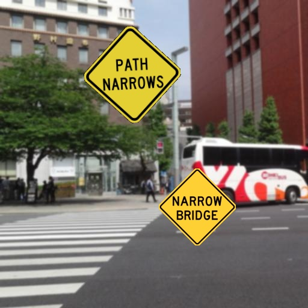

# YOLO_Realistic_USA_RoadSigns
This is a USA RoadSigns train and valid dataset annotated by YOLO format.
It contains 86 classes, and each image size is 512x512.

# Sample Images

<table>
<tr><td>

</td></tr>
<tr><td>

</td></tr>
<tr><td>

</td></tr>
<tr><td>

</td></tr>
<tr><td>

</td></tr>
<tr><td>

</td></tr>

</table>

